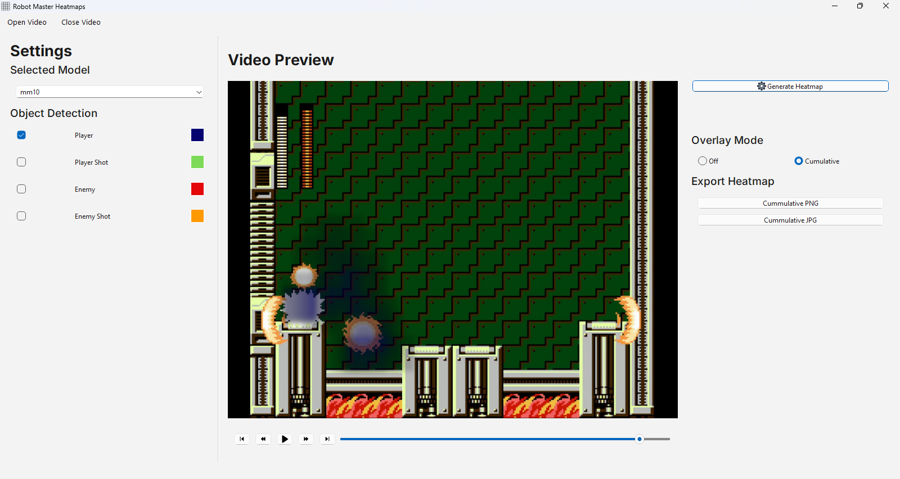
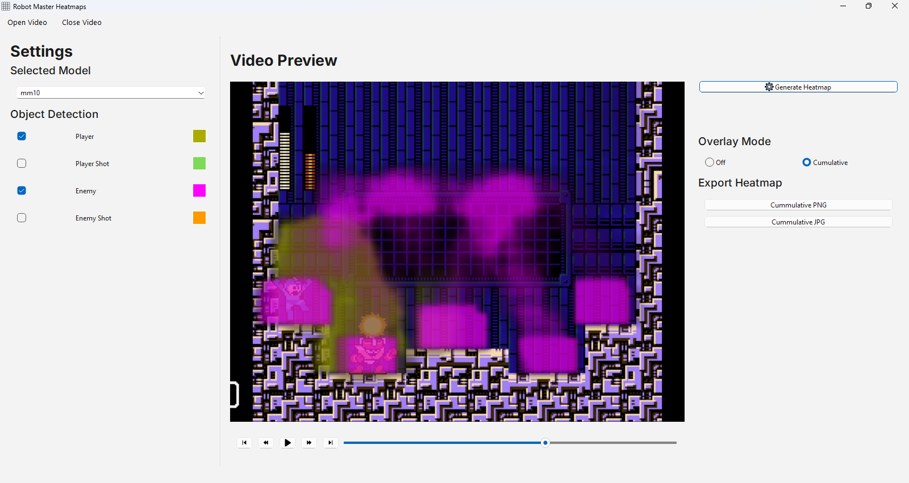
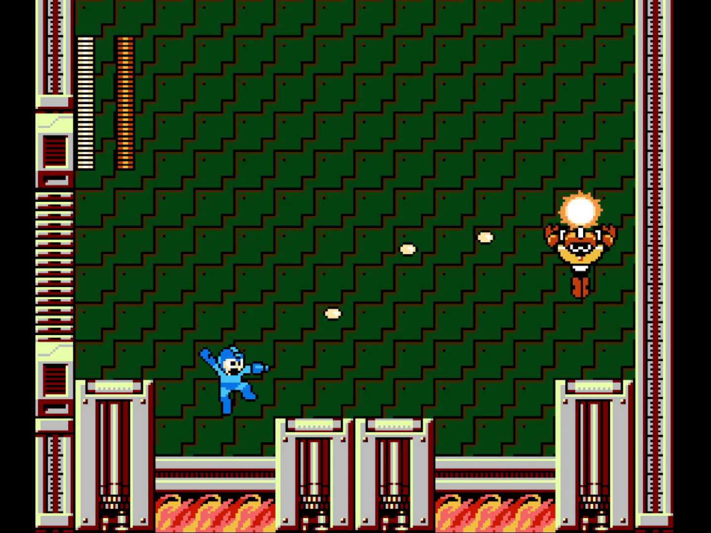
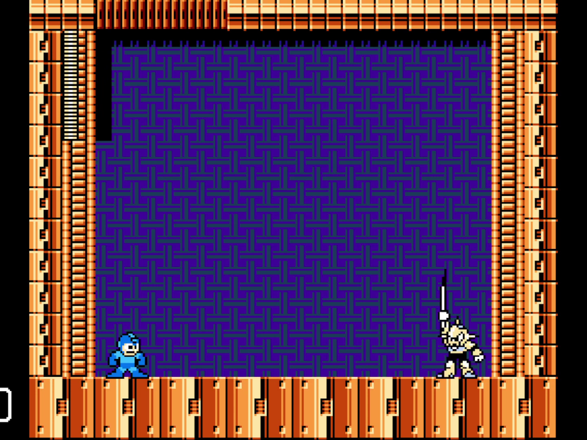
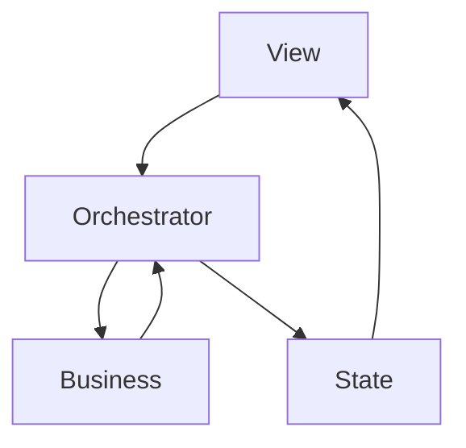

### robot-masters-heatmaps
Analyze boss movement patterns in Megaman games to visualize safe and dangerous zones.

1. [How To Use](#how-to-use)
2. [Setup](#setup)
3. [ETL](#etl)
   - [In-game settings](#in-game-settings-options)
   - [OS settings](#os-settings)
   - [OBS Studio settings](#obs-studio-settings)
5. [Architecture](#architecture)
5. [TODO](#todo)
5. [Disclaimer](#disclaimer)
5. [Icons and Fonts](#icons-and-fonts)

#### How To Use:
1. Open gameplay footage by clicking on the "Open Video" button at the top menu bar.
2. Select the name of the model that matches your footage game (mm10 corresponds to Megaman 10 and so on).
3. Check which game elements you wish to visualize on a heatmap.
Additionally you can change the color that will be used for each element on the heatmap.
4. Click on the "Generate Heatmap" button.
5. Wait for the heatmap to be generated and displayed automatically over the game footage.
6. Optionally, you can choose to hide/display the heatmap as an overlay while playing the video footage.
7. Exporting the heatmap as png will preserve the alpha channel, exporting it as jpg will turn the alpha channel into a black color.

Processing a short video (~5s)

Processing a longer video (~40s)


The following table illustrates the robot masters supported by each model, processing a video with an enemy not present
does not guarantee accurate results:

| Game | Supported Robot Masters |
| :------------ | :------------ |
| Megaman 10 | Solarman |
^Updates to the project will contain support for more robot masters.

Notes:
- Projectile detections may be inaccurate when using a weapon other than the default Mega Buster as the models cannot
know whether the player or the enemy shot a projectile, only that it appeared.
- Video length, video resolution and video frame rate contribute in great measure to the processing time of a new heatmap.

#### Setup
1. Clone the repository.
2. Create and activate a virtual environment.
3. Install dependencies from `src/requirements.py`.
4. Run with main.py as entry point. Ensure your working directory is `src`.

#### ETL
The images used to train the YOLO models come from recording my display via OBS Studio, game footage comes from the Steam
versions of Megaman Legacy Collection 1 & 2. The setup is as follows...

The following settings do not necessarily indicate strict input video configurations,
but you are expected to process videos that satisfy at least the same in-game settings, otherwise, accurate results are not guaranteed.

##### In-game settings (options):
- Screen: Full
- Background: Off
- Filter: Off

^Engines other than the Legacy Collections' may do as long as a 4:3 aspect ration is maintained without stretching the game.

##### OS settings:
- Game on fullscreen
- Computer Display: 1600x900

##### OBS Studio settings:

(Output: Recording)
- Recording Quality: High Quality
- Recording Format: Hybrid MP4 (.mp4)

After recording, the frames are extracted using the script at `src/ml/scripts/video/frames.py`; such script uses
a `cv2.VideoCapture` to iterate over all frames, each one of them gets cropped to `4:3` (as this removes noisy letterboxing)
before being saved on a temporal directory on project's root.

Such process should generate frames as the following:





With our base model being `YOLO("yolov5m.pt")`, the following training parameters are applied:
```
model.train(
    ...
    data="../data/mm10/dataset.yaml",  # src/ml/data/mm10/dataset.yaml
    epochs=100,
    imgsz=800,
    batch=-1,
    ...
)
```

After training, demo predictions and metrics are generated for the best weights model using `src/ml/scripts/train.py`,
the last remaining task is to move the model to the `src/gui/resources/models` directory. A new model gets
recognized automatically by the gui just by being in there.

#### Architecture
The gui application architecture is inspired on MVVM whilst using the observer design pattern and a reactive state.



- View calls for Orchestrator; a single View event (such as a button click, or a release on a slider) triggers a
single function from Orchestrator.
- Orchestrator executes functions from the Business modules; a single Orchestrator function calls `n` Business functions,
passing parameters to them and saving the results (returns).
- While executing Business modules, Orchestrator reads and modifies State.
- State emits signals on modification.
- View listen for State's signals, on receiving such, executes functions that exclusively modify UI.

Notes:
- There's only one window for this application.
- Custom widgets are comprised of multiple PySide6 (Qt for Python) widgets.
- A widget event (button click, slider release, ...) does have at most a single Orchestrator function connected.

---

#### TODO:

- The app will not find the yolo models if its entry point `main.py` gets executed from any directory other than `src/`.
As it assumes that all executions stem from the working directory `src/`.
- It would be cleaner for the `src/ml/scripts/train.py` script to receive a parameter indicating the game the model's being trained on.
- It might be possible to crop input videos down to a 4:3 aspect ratio.
Although this might make heatmap generation and z-indexing more complex on View.
- The `crop` method on `src/ml/scripts/video/frames.py` is eligible to get cache support,
avoiding recalculation of the same new video dimensions.
- Add a confirmation popup when trying to exit the app while a heatmap is being generated.
- Move the heatmap generation process to a thread so the app doesn't freeze.
It'll be necessary to block access to state.
- Free memory from previous yolo model when loading a new one, task deferred until a new model is ready for use.
Something akin to the following would do:
```
    #del self.model
    #self.model = None
    #if torch.cuda.is_available():
        #torch.cuda.empty_cache()
```
- Perhaps support for multiple-GPU usage on training/prediction.
- Hardcoded routes may not be compatible on all OS.

##### Disclaimer
This software is a non-profit, educational project not affiliated with, endorsed by, or sponsored by Capcom.

Users are expected to provide their own legally obtained gameplay footage.

##### Icons and Fonts:
- Google Fonts and the late IconFinder.

Check individual licenses before redistribution.
